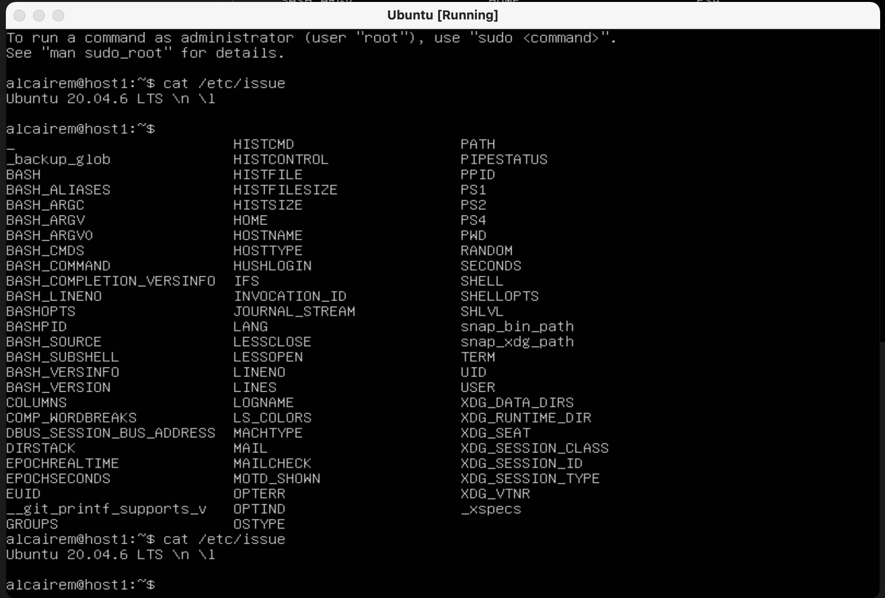

# Linux

## Part 1. Установка ОС

Установил Ubuntu 20.04 Server LTS без графического интерфейса с использованием программы для VirtualBox



## Part 2. Создание пользователя

Скриншот вызова команды для создания пользователя, отличного от пользователя. Новый пользователь alcairem_user, старый alcairem:


Наблюдаем нового пользователя в выводе команды cat /etc/passwd:


Из - за большого списка не видно команды, соотвественно использовал команду grep для видимости:


Добавляю пользователя alcairem_user в группу adm:


## Part 3. Настройка сети ОС

1. Открыть файл /etc/hostname в текстовом редакторе vim:
    
    
    sudo vim /etc/hostname
    

A. Внутри этого текстового редактора меняем имя машины на user-1

B. Отредактировать файл /etc/hosts, чтобы обновить соответствие между IP-адресом и именем машины:

sudo vim /etc/hosts

C. Найти строку, содержащую имя машины (обычно она будет содержать 127.0.1.1). Заменить существующее имя на новое имя, user-1

D. Перезагружаю сервер для актуализации изменений:

sudo reboot

1. Устанавливаю временную зону, соответствующую моему текущему местоположению:


Вывод текущего времени:


1. Вывожу названия сетевых интерфейсов с помощью консольной команды ifconfig:


Наблюдаю 2 сетевых интерфейса: enp0s3 и lo

lo – интерфейс локальной петли, который служит для подключения по сети к этому же компьютеру (127.0.0.1), он не требует дополнительной настройки. Это поддиректория, соответствующая интерфейсу "lo" (loopback), используемому для локального обмена данными на уровне сетевого стека.

Чтобы отобразить настройки какого-то конкретного интерфейса, используйте команду ifconfig eth0, где eth0 - это имя интерфейса.

Также можно вывести сетевые интерфейсы следующей командой:


1. Используя консольную команду **sudo dhclient -v** получаю ip адрес устройства, на котором я работаю, от DHCP сервера.


**Полезные статьи про DHCP:** 

1. [https://andreyex.ru/debian/kak-obnovit-ip-adres-dhcp-v-debian-11/](https://andreyex.ru/debian/kak-obnovit-ip-adres-dhcp-v-debian-11/)
2. [https://selectel.ru/blog/dhcp-protocol/](https://selectel.ru/blog/dhcp-protocol/)

DHCP — протокол прикладного уровня модели TCP/IP, служит для назначения IP-адреса клиенту. Это следует из его названия — Dynamic Host Configuration Protocol. IP-адрес можно назначать вручную каждому клиенту, то есть компьютеру в локальной сети. Но в больших сетях это очень трудозатратно, к тому же, чем больше локальная сеть, тем выше возрастает вероятность ошибки при настройке. Поэтому для автоматизации назначения IP был создан протокол DHCP.

1. Определил и вывел на экран двумя командами внешний ip-адрес шлюза (ip) и внутренний IP-адрес шлюза, он же ip-адрес по умолчанию (gw): **ip route** и **ip route | grep default**


1. Задал статичные (заданные вручную, а не полученные от DHCP сервера) настройки ip, gw, dns (использовал публичный DNS серверы, например 1.1.1.1 или 8.8.8.8).

Прежде чем это сделать, нужно отключить облачную инициализацию через команду **sudo vim /etc/netplan/00-installer-config.yaml** и в данном коде задать вручную настройки ip, gw и dns: 


Применяем новую конфигурацию сети с помощью команды **sudo netplan apply,** а далее проверяем через команду **routel** правильно ли мы изменили:


Как видим, напротив default присутствует запись static, что свидетельствует о ручном внесении.

Полезная статья про заданные вручную настройки ip, gw, dns: [https://setiwik.ru/kak-nastroit-staticheskiy-ip-adres-v-ubuntu-20-04-lts/](https://setiwik.ru/kak-nastroit-staticheskiy-ip-adres-v-ubuntu-20-04-lts/)

Полезная статья про методы проверки IP-адреса шлюза или маршрутизатора по умолчанию в Linux: [https://itisgood.ru/2019/05/06/chetyre-metoda-proverki-ip-adresa-shljuza-ili-marshrutizatora-po-umolchaniju-v-linux/](https://itisgood.ru/2019/05/06/chetyre-metoda-proverki-ip-adresa-shljuza-ili-marshrutizatora-po-umolchaniju-v-linux/)

1. Успешно пропинговываем удаленные хосты 1.1.1.1 и [ya.ru](http://ya.ru/) и вставил в отчёт скрин с выводом команды. В выводе команды есть фраза "0% packet loss". Использовал по 5 примеров на хосте и сайте.
    
    
    

PING означает Packet InterNet Groper. Утилита или программа для определения того, доступен ли конкретный IP-адрес из вашей сети или хост / сервер. Утилита Ping обычно используется для проверки **[сетевых ошибок и диагностики](https://blog.sedicomm.com/2018/07/06/mtr-instrument-setevoj-diagnostiki-dlya-linux/)** этой проблемы.

Благодаря пингу вы можете узнать, доступен ли хост из вашей сети и как быстро вы получаете ответ от этого хоста после того, как вы отправили запрос Ping. Маленький пинг, или низкая латентность означает более отзывчивое соединение, особенно в приложениях, где время – это все (например, онлайн-игры).

Полезная статья про пинг: [https://blog.sedicomm.com/2017/06/12/vse-o-komande-ping/](https://blog.sedicomm.com/2017/06/12/vse-o-komande-ping/)

## Part 4. Обновление ОС

Обновил системные пакеты до последней на момент выполнения задания версии командой **sudo apt update:**


а затем **sudo apt upgrade:**


## Part 5. Использование команды **sudo**

**sudo -** это программа командной строки, которая позволяет доверенным пользователям выполнять команды от имени пользователя root или другого пользователя.

Самый простой способ предоставить пользователю привилегии sudo — добавить пользователя в группу «sudo». Члены этой группы могут выполнять любую команду от имени root через sudo ****и получать запрос на аутентификацию с помощью своего пароля при использовании sudo.

1. Разрешил пользователю, созданному в Part 2 (alcairem_user), выполнять команду sudo с помощью команды **sudo usermod -aG sudo alcairem_user**. То есть я данной командой пользователя alcairem_user добавил в группу sudo для пользования им команды sudo.


Далее проверяю добавлен ли данный юзер в группу и имеет ли возможность пользования командой sudo. Проверяю командой **groups alcairem_user**:


Команда groups user предназначена для вывода списка групп, в которых состоит пользователь с указанным именем.

1. Поменял hostname ОС от имени пользователя, созданного в пункте Part 2 (используя sudo) с user_1 на user_2:


Проверяем выполнил ли я данное условие:


## Part 6. Установка и настройка службы времени

Настраиваю службу автоматической синхронизации времени.

1. Вывожу время часового пояса, в котором я сейчас нахожусь.


Проверяю командой **timedatectl show** синхронизацию времени (свидетельствуют слова “yes”):


## Part 7. Установка и использование текстовых редакторов

1. Устанавливаю текстовые редакторы **VIM** (+ любые два по желанию **NANO**, **MCEDIT**, **JOE** и т.д.)

**Vim** у меня уже был установлен, о чем свидетельствует выведенная фраза “vim is already the newest version” после команды **sudo apt-get install vim**


У редактора **nano** то же самое:


Устанавливаю редактор joe: **sudo apt-get install joe**


После установки еще раз ввожу данную команду для проверки установки, вышла такая же фраза, как и в предыдущие разы с другими редакторами: **joe is already the newest version**


1. Задание: Используя каждый из трех выбранных редакторов, создайте файл *test_X.txt*, где X -- название редактора, в котором создан файл. Напишите в нём свой никнейм, закройте файл с сохранением изменений.

**VIM:**


Содержимое:


Команда на VIM для выхода с сохранением: ESC : wq

**NANO:**


Проверка на сохранение файла:


Команда на NANO для выхода с сохранением: CTRL + K, а после y

**JOE:**


Проверка на сохранение файла:


Команда на JOE для выхода с сохранением: CTRL + K, а после x

1. Задание: используя каждый из трех выбранных редакторов, откройте файл на редактирование, отредактируйте файл, заменив никнейм на строку "21 School 21", закройте файл без сохранения изменений.

**VIM:**


Команда на VIM для выхода без сохранения: ESC : q!

**NANO:**


Команда на NANO для выхода без сохранения: CTRL + X, а после no (для того, чтобы не сохранились изменения)

**JOE:**


Изменил запись. Теперь выхожу без сохранения с помощью команды CTRL + K, затем q (выход) и n (no - без сохранения)


1. Задание: Используя каждый из трех выбранных редакторов, отредактируйте файл ещё раз (по аналогии с предыдущим пунктом), а затем освойте функции поиска по содержимому файла (слово) и замены слова на любое другое.

**VIM:**


**Команда поиска слова:** Двоеточие, / искомое слово. Курсор автоматически переходит на строку, где находится нужное слово


**Команда замены слова:** :s/заменяемое слово/слово, которое будут использовать для замены

**NANO:**


**Команда поиска слова:** Ctrl+W, пишем искомое слово, затем ENTER


**Команда замены слова:** Ctrl+\, введите слово, которое необходимо искать и нажмите клавишу Enter. Затем введите слово, на которое произвести замену и нажмите Enter, а далее клавишу “y” (yes).

**JOE:**


**Команда поиска слова:** Ctrl+G


Команда замены: R


Далее нажимаем y (yes) для замены слов


## Part 8. Установка и базовая настройка сервиса **SSHD**

1. Задание: Установить службу SSHd

**SSHd** - это служба, принимающая запросы на соединения от клиентов. Обычно она запускается при загрузке системы из /etc/rc. Для каждого нового соединения создаётся (с помощью вызова *fork*) новый экземпляр службы. Ответвлённый экземпляр обрабатывает обмен ключами, шифрование, аутентификацию, выполнение команд и обмен данными.

Команда для установки SSHd: **sudo apt install openssh-server**


1. Задание: Добавить автостарт службы при загрузке системы

Проверяем работу службы с помощью команды **sudo systemctl status ssh:**


Для добавления автостарта нужно ввести команду **sudo systemctl enable ssh:**


1. Задание: Перенастроить службу SSHd на порт 2022

Используем команду **sudo vim /etc/ssh/sshd_config**

Далее видим строчку #Port 22, редактируем ее на #Port 2022 и **раскомменчиваем**


Задание 4: Используя команду ps, показать наличие процесса sshd. Для этого к команде нужно подобрать ключи.

Команда ps выводит список текущих процессов на вашем сервере в виде таблицы, с которой можно удобно работать: сортировать, изменять количество колонок и прочие. У утилиты ps множество настроек, с помощью которых можно тонко настраивать вывод команды, также никто не запрещает вам делать конвейеры, чтобы отсечь всё лишнее.

Для того, чтобы увидеть наличие процесса sshd вводим команду **ps -ef | grep sshd:**


Ключи **-ef** нужны для более подробной информации о запущенных процессах.

Полезная статья: [https://blog.sedicomm.com/2018/05/28/30-poleznyh-komand-ps-dlya-monitoringa-protsessov-linux/](https://blog.sedicomm.com/2018/05/28/30-poleznyh-komand-ps-dlya-monitoringa-protsessov-linux/)

Задание 5: Перезагрузить систему

Делаю это с помощью команды **sudo reboot**

Задание 6: Вывод команды netstat -tan должен содержать

```
tcp 0 0 0.0.0.0:2022 0.0.0.0:* LISTEN
```

А также нужно объяснить значение ключей -tan, значение каждого столбца вывода, значение 0.0.0.0.


Утилита **netstat** — консольный инструмент Linux, который используется системными администраторами для оценки конфигурации и активности сети.

Утилита позволяет увидеть открытые порты на хост-устройстве и соответствующие им адреса, таблицу маршрутизации и скрытые соединения.

**netstat**: Команда для отображения информации о сетевых соединениях.

- Опция **t** отображает активные TCP-соединения, **a** показывает все соединения и прослушиваемые порты. Опция **n** отключает разрешение имен хостов и портов и отображает числовые значения.

Команда **netstat -tan** отобразит список активных сетевых соединений и прослушиваемых портов в следующем формате:

- **Proto**: Протокол сетевого соединения (например, TCP или UDP).
- **Recv-Q**: Размер очереди приема для соединения.
- **Send-Q**: Размер очереди отправки для соединения.
- **Local Address**: Локальный IP-адрес и порт соединения.
- **Foreign Address**: Внешний (удаленный) IP-адрес и порт соединения.
- **State**: Состояние соединения (например, ESTABLISHED, LISTENING, WAITING и т. д.).

Эта команда позволяет  увидеть текущие активные TCP-соединения и открытые прослушиваемые порты на вашей системе. 

## Part 9. Установка и использование утилит **top**, **htop**

1. Задание: Установить и запустить утилиты top и htop.

**TOP**

Утилита **top** предустановлена в UNIX-системах, поэтому для запуска  достаточно подключиться к серверу по [SSH](https://help.sweb.ru/entry/84/) и выполнить команду **top (**просто вводим данное слово в ubuntu)


Вверху выводится информация о системе, ниже - список процессов. Вывод обновляется каждые 2 секунды. Процессы, оказывающие самую большую нагрузку на процессор, будут выведены вверху списка.

Слева вверху указано текущее время системы, далее:

- **Up** - время работы системы с последнего запуска
- **User** - количество текущих пользователей.
- **Load average** - средняя нагрузка на сервер: отображаются значения за одну, пять и 15 минут назад.
- **Tasks** - общее количество запущенных процессов в разных статусах (running - выполняемые; sleeping - в ожидании; stopped - остановленные; zombie - "зомби", дочерние процессы, ожидающие завершения родительского процесса).
- **Cpu(s**) - процент времени процессора, затраченного на выполнение процессов, в том числе:**us** - пользовательские процессы (высокое значение данного показателя может указывать, в том числе, на ошибки в коде сайта, необходимость его оптимизации);**sy** - процессы ядра;**id** - неиспользуемые ресурсы (чем выше этот показатель, тем лучше);**wa** - операции ввода/вывода, т.е. дисковые операции.
- **Mem, Swap** - сведения об использовании оперативной памяти (total - общий объем, free - объем свободной памяти, used - объем использованной памяти).

Итак:

**Uptime:** 15:17:41 up 23 min

**Количество авторизованных пользователей:** 1 user

**Общая загрузка системы:** 0.00

**Общее количество процессов:** 94

**Загрузка cpu:** 0,3% (пользовательские процессы)

**Загрузка памяти:** 145,6 mib

**Pid процесса занимающего больше всего памяти:** (команда SHIFT + M), где М - сортировка по используемой памяти. Наше значение **647** (самая первая строчка, т.к. по умолчанию процессы выстроены в таблице по размеру нагрузки на процессор - от большего к меньшему).


**Pid процесса, занимающего больше всего процессорного времени:** 

SHIFT + F, попадаем в интерактивное поле, выбираем ячейку TIME+ , нажимаем **d,** для сортировки по выбранному полю, нажимаем **s**.


**Обозначения столбцов:**

- **PID** - идентификатор процесса;
- **USER** - пользователь, запустивший процесс;
- **PR** - приоритет процесса;
- **NI** - измененный приоритет (присвоенный пользователем с помощью команды nice);
- **VIRT** - объем используемой виртуальной памяти (здесь выводится тот объем памяти, который был запрошен процессом, даже если фактически используется меньше);
- **RES** - объем используемой оперативной памяти (в данном случае, если процесс запросил 50Мб памяти, а использует 10Мб, будет выведено 10Мб);
- **SHR** - объем памяти, разделяемой с другими процессами (т.е. память, которая может быть использована другими процессами);
- **S** - статус процесса (running - запущен; sleeping - в ожидании; zombie - процесс-"зомби");
- **%CPU** - процент использования процессорного времени;
- **%MEM** - процент использования оперативной памяти;
- **TIME** - общее время работы процесса;
- **COMMAND** - имя процесса (команда, которой был запущен процесс).

Полезная статья по top и htop: [https://help.sweb.ru/entry/999/](https://help.sweb.ru/entry/999/)

Полезная статья по top: [https://zalinux.ru/?p=1811](https://zalinux.ru/?p=1811)

**HTOP**

**htop** — продвинутый монитор процессов, написанный для Linux. Он был задуман заменить стандартную программу top. Htop показывает динамический список системных процессов, список обычно выравнивается по использованию ЦПУ. В отличие от top, htop показывает все процессы в системе. Также показывает время непрерывной работы, использование процессоров и памяти. Htop часто применяется в тех случаях, когда информации даваемой утилитой top недостаточно, например при поиске утечек памяти в процессах. Htop написан на языке Си и использует для отображения библиотеку Ncurses.

Значения столбцов в **htop** те же, что в **top**.

Вводим команду **htop**


Нажимаем клавишу F6 и выбираем нужную для нас сортировку:

1. PID


1. PERCENT_CPU


1. PERCENT_MEM


1. TIME


1. Отфильтрованному для процесса sshd: нажимаю F3 и пишу слово “sshd”


1. С процессом syslog, найденным, используя поиск: нажимаю клавишу \ и пишу слово “syslog”:


1. С добавленным выводом hostname, clock и uptime

Делается через клавишу F2, но она у меня не работает в ubuntu. Пришлось открыть софтовую клавиатуру и нажать F2:


Добавляю hostname, clock и uptime и закрепляю в right column через enter:


Полезная статья про htop: [https://zalinux.ru/?p=3581](https://zalinux.ru/?p=3581)

## Part 10. Использование утилиты **fdisk**

Задание: Запустить команду fdisk -l

Утилита fdisk позволяет создавать разделы на жестком диске и управлять ими (обычно в роли жесткого диска выступает вращающийся носитель, однако утилита fdisk может работать и с другими устройствами, такими как карта Compact Flash или флэш-накопитель USB, если на них поддерживаются основные загрузочные записи (MBR) и разделы в стиле IBM PC). Формат информации о разделах, которая хранится в первом физическом блоке диска, совпадает с форматом, используемым в системе DOS.


Название жесткого диска: /dev/sda

Размер: 7 GiB

Количество секторов: 14680064

Размер swap: 729Mi (команда free -h)


**SWAP (своп)** — это механизм виртуальной памяти, при котором часть данных из оперативной памяти (ОЗУ) перемещается на хранение на HDD (жёсткий диск), SSD (твёрдотельный накопитель).

Swap-раздел позволяет увеличить доступное пространство памяти, но работа с данными в нем может быть медленнее, чем в физической памяти, так как операции чтения/записи происходят на диске. Swap-раздел особенно полезен в случаях, когда система испытывает нехватку памяти и нуждается в дополнительном пространстве для работы приложений и хранения данных.

## Part 11. Использование утилиты **df**


Команда **df** показывает список всех файловых систем по именам устройств, сообщает их размер, занятое и свободное пространство и точки монтирования.

Запустим команду **df -h** (размер без флага -h в килобайтах):


для корневого раздела (/):

1. Размер раздела: 5.1 Gb
2. Размер занятого пространства: 3.5 Gb
3. Размер свободного пространства: 1.4 Gb
4. Процент использования: 72%

Запускаю команду **df -Th:**


для корневого раздела (/):

1. Размер раздела: 5.1 Gb
2. Размер занятого пространства: 3.5 Gb
3. Размер свободного пространства: 1.4 Gb
4. Процент использования: 72%
5. Тип файловой системы для раздела: ext4

## Part 12. Использование утилиты **du**

Запускаю команду **du**:


Команда du **выдает количество килобайтных блоков, содержащихся во всех заданных файлах, среди которых могут быть каталоги**. Обход каталогов выполняется, начиная с указанных, рекурсивно на любую глубину. При подсчете учитываются косвенные блоки файлов.

Для того, чтобы получить объемы директорий в килобайтах и мегабайтах следует использовать параметр **-h**:

Команда **du -h /home**


Команда **du -h /var**


Команда **du -h /var/log**


Вывожу размер всего содержимого в /var/log (не общее, а каждого вложенного элемента, используя *)

Команда **du -h /var/log/***


## Part 13. Установка и использование утилиты **ncdu**

Утилита **ncdu** представляет собой графический интерфейс команды du, для детального анализа занимаемого пространства.

Устанавливаем данную утилиту с помощью команды **sudo apt install ncdu**:


Размер папки /home: **ncdu /home**


Размер папки /var: **ncdu /var**


Размер папки /var/log: **ncdu /var/log**


## Part 14. Работа с системными журналами

Открываю для просмотра **/var/log/auth.log:**


Перезапускаем службу sshd командой **sudo systemctl restart ssh** и находим информацию о перезапуске в файле /var/log/syslog


Информацию о перезапуске также можно найти в логах авторизации


## Part 15. Использование планировщика заданий **CRON**

Crontab - это служба, которая присутствует в Unix и Unix-подобных операционных системах, используется для планирования периодического выполнения команд.

Формат записей. Звезды представляют собой различные части даты, их последовательность следующая:

- минута (от 0 до 59)
- час (с 0 до 23)
- день месяца (с 1 по 31)
- месяц (от 1 до 12)
- день недели (от 0 до 6) (0=воскресенье)

 `* * * * * /home/myscript.sh`

CRON-задачи и их расписание определяются в специальных файлах, таких как /etc/crontab или файлы в директории /etc/cron.d, а также в файле персональных CRON-задач пользователя crontab.

Открываем CRON - редактор командой **crontab -e**


Проверяем выполнилась ли задача в логах /var/log/syslog:


Проверяем список текущих задач, очищаем его и снова выводим:

